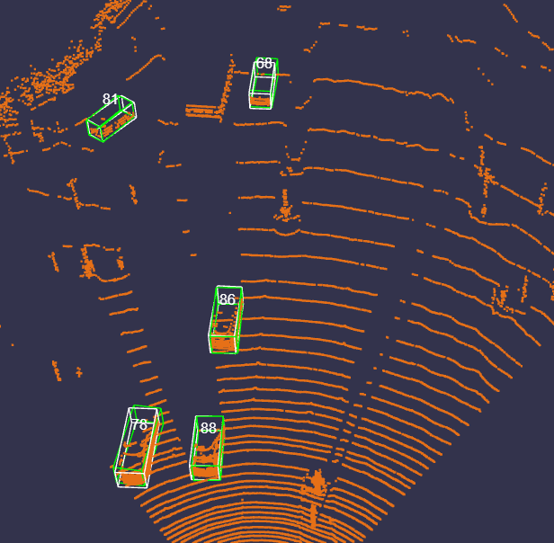
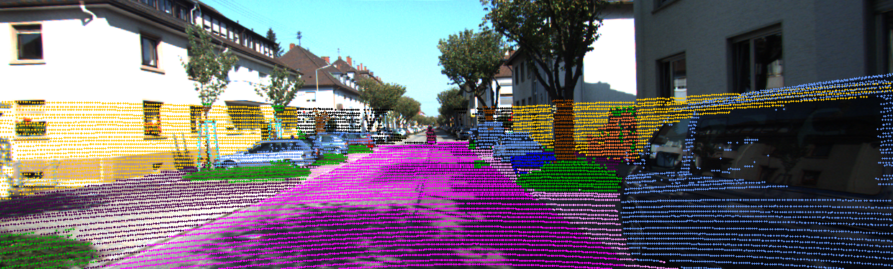
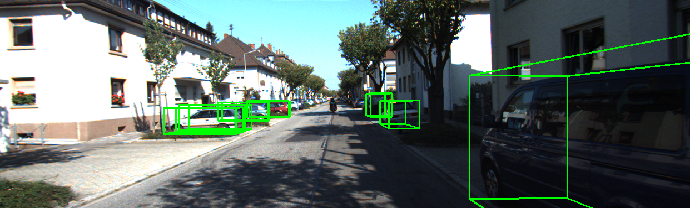

# Lukas Amiet — ETH Zürich · Machine Learning & AI

A selection of my ML / AI work from my BSc (Mechanical Engineering) and MSc
(Robotics, Systems & Control) at ETH Zürich — course projects, my bachelor's thesis,
and lab & team robotics. The code is kept in a **private repository** (ETH doesn't
permit publishing graded course solutions), but I'm happy to guide you through it or
grant limited access on request.

> 🔒 **Code:** [`amietlukas/eth-ml-projects`](https://github.com/amietlukas/eth-ml-projects) *(private — access on request)*
> 📫 [lukas.amiet@bluewin.ch](mailto:lukas.amiet@bluewin.ch) · [linkedin.com/in/lukas-amiet](https://linkedin.com/in/lukas-amiet)

---

## Embedded ML on Microcontrollers — *ETH PBL*

[**`embedded-vision-rc-car`**](https://github.com/amietlukas/embedded-vision-rc-car) *(public repo)* —
a full edge-ML pipeline (dataset → trained model → quantized & pruned network) for an
RC car driven by **two STM32 boards**, with every model running **on-microcontroller** —
no PC in the loop:

- **Hand-gesture classifier** *(on an STM32U5)* — reads hand gestures from the camera
  and sends drive commands to the car over Bluetooth.
- **Ball detector** *(on an STM32N6 NPU)* — a YOLO-style network finds a ball and
  pans/drives the car to chase it autonomously.

Both models are trained on a PC but designed **hardware-aware** from the start —
INT8 quantization and pruning, PyTorch → ONNX → on-device — to fit the Cortex-M / NPU targets.

  

## Bachelor's Thesis — *ETH PBL · grade 6.0 / 6.0*

**[Embedded Deep Learning for Real-Time Aerodynamic Flow Estimation on Wind-Turbine
Blades Using MEMS Pressure Sensors](https://github.com/amietlukas/eth-ml-projects/tree/main/bachelor-thesis)** — Center for Project-Based
Learning (PBL), ETH Zürich (MISTERY project). Lightweight CNNs/MLPs infer angle of
attack, wind speed, flow separation and stagnation point from 10 MEMS pressure
sensors, deployed on an STM32H5 microcontroller (MAE < 1°, 12 ms on-device inference).

- **ML** — lightweight CNNs / MLPs
- **Embedded** — ONNX → STM32 X-CUBE-AI
- **Hardware** — 10 MEMS sensors, STM32H5

→ [full write-up & results](https://github.com/amietlukas/eth-ml-projects/tree/main/bachelor-thesis)

## Computer Vision & AI for Autonomous Cars — *ETH TRACE*

Autonomous-driving perception: 3D LiDAR object detection, point-cloud semantic
segmentation, and monocular depth estimation.

- **[`CVAIAC/object-detection-lidar/`](https://github.com/amietlukas/eth-ml-projects/tree/main/CVAIAC/object-detection-lidar)** — 3D vehicle
  detection from LiDAR point clouds: point-cloud → camera projection with semantic
  labels, 3D bounding-box detection, and a stage-2 refinement study (Soft-NMS and
  geometric attention improved mAP) on a two-stage, PointRCNN-style detector.
- **[`CVAIAC/image-depth-segmentation/`](https://github.com/amietlukas/eth-ml-projects/tree/main/CVAIAC/image-depth-segmentation)** —
  point-cloud semantic segmentation + monocular depth estimation.

  

  
  &nbsp;
  

## Probabilistic Artificial Intelligence (PAI)

- **[`PAI/task0`](https://github.com/amietlukas/eth-ml-projects/tree/main/PAI/task0)** — Bayesian inference over a hypothesis space (Normal / Laplace / Student-t)
- **[`PAI/task1`](https://github.com/amietlukas/eth-ml-projects/tree/main/PAI/task1)** — Gaussian-Process regression with an asymmetric cost function
- **[`PAI/task2`](https://github.com/amietlukas/eth-ml-projects/tree/main/PAI/task2)** — Bayesian deep learning: uncertainty calibration for image classification
- **[`PAI/task3`](https://github.com/amietlukas/eth-ml-projects/tree/main/PAI/task3)** — Constrained Bayesian Optimization with Gaussian Processes

## Computer Vision

- **[`lab01`](https://github.com/amietlukas/eth-ml-projects/tree/main/computer-vision/lab01-local-features)** — Harris corners, descriptors, matching
- **[`lab02`](https://github.com/amietlukas/eth-ml-projects/tree/main/computer-vision/lab02-model-fitting-and-sfm)** — RANSAC, two-view geometry, structure-from-motion
- **[`lab03`](https://github.com/amietlukas/eth-ml-projects/tree/main/computer-vision/lab03-deep-learning)** — MLP / CNN classifiers (2D points, MNIST, CIFAR-10)
- **[`lab04`](https://github.com/amietlukas/eth-ml-projects/tree/main/computer-vision/lab04-meanshift-segnet)** — Mean-shift clustering + SegNet segmentation
- **[`lab05`](https://github.com/amietlukas/eth-ml-projects/tree/main/computer-vision/lab05-point-tracking)** — RAFT optical flow + point tracking
- **[`lab06`](https://github.com/amietlukas/eth-ml-projects/tree/main/computer-vision/lab06-variational-autoencoder)** — Variational autoencoder on MNIST

## Introduction to Machine Learning (IML)

- **[`task1a`](https://github.com/amietlukas/eth-ml-projects/tree/main/IML/task1a)** — Ridge regression with k-fold cross-validation
- **[`task1b`](https://github.com/amietlukas/eth-ml-projects/tree/main/IML/task1b)** — Linear regression on engineered nonlinear features
- **[`task2`](https://github.com/amietlukas/eth-ml-projects/tree/main/IML/task2)** — Regression with preprocessing on tabular data
- **[`task3`](https://github.com/amietlukas/eth-ml-projects/tree/main/IML/task3)** — Image-similarity learning from triplets (transfer-learned CNN embeddings)

## Stochastics & Machine Learning

- **[`eth-mugs-finder/`](https://github.com/amietlukas/eth-ml-projects/tree/main/eth-mugs-finder)** — binary semantic segmentation of mugs
  ("ETH Mugs" dataset), a trained U-Net (PyTorch).
- **[`distance-guesser/`](https://github.com/amietlukas/eth-ml-projects/tree/main/distance-guesser)** — distance regression from downsampled
  RGB image features (scikit-learn SVM + grid search).

---

## Robotics — research & team projects

### Robotic Systems Lab (RSL) — ANYmal-D solving a giant Rubik's cube via pedipulation
*Perception & Learning for Robotics (PLR) — completed* 
*Semester thesis — ongoing*

Teaching a quadruped (ANYmal-D) to manipulate and solve a giant Rubik's cube:
- Reinforcement learning in **Isaac Lab / Isaac Sim** (RSL-RL) — articulated cube asset, reward shaping, curriculum, RND exploration, PPO teachers + perception-based student distillation.
- **Sim-to-real** transfer and deployment on ANYmal-D hardware, with real-world failure diagnosis and iterative policy refinement.
- Onboard cube perception: SAM-based segmentation, depth, colour classification, 6D pose estimation.

### NomadZ — autonomous humanoid soccer (RoboCup)
Building the software stack for fully autonomous humanoid soccer robots with [**ETH NomadZ**](https://github.com/nomadz-ethz):
- Implemented a **Kalman-filter ball-tracking** module (ROS 2).
- Improved **2D → 3D ball localization** from YOLOv8 detections.
- Work on the **Booster K1 and T1** humanoid platforms.

---

## Other relevant coursework

Foundational courses behind the projects above:

- **Estimation & control** — Recursive Estimation · Model Predictive Control · Control Systems I & II · Autonomous Mobile Robots · Robot Dynamics
- **Probability, signals & systems** — Probability & Statistics · Signals & Systems · Embedded Systems
